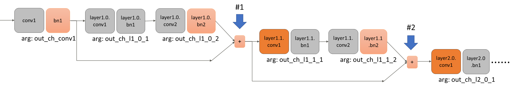

# Automatic Pruning Ver 1.1.0

Automatic Pruning is a Python module for pruning neural networks.
This module has the following features.
* The pruning rate of each layer can be determined automatically.
* It can also be applied to convolution layers to which BatchNorm layers are not connected and fully connected layers.  
* Pre-trained model & pruned model data for example codes are published in following site.  
  Pre-trained model : https://zenodo.org/record/5725006#.YZ5cSNDP0uU  
  Pruned model      : https://zenodo.org/record/5725038#.YZ5cY9DP0uU  
  
|Dataset|Model|Pre-trained model accuracy(%)|Pruned model accuracy(%)|Pre-trained model size(MB)|Pruned model size(MB)|Model size compression ratio(%)| 
|:----:|:----:|:----:|:----:|:----:|:----:|:----:|
|MNIST|3-layer MLP|98.44|97.48|7.46|1.14|84.7|
|CIFAR10|AlexNet|90.59|89.62|145.50|1.87|98.7|
|CIFAR10|vgg11|85.70|84.71|515.23|0.80|99.8|
|CIFAR10|vgg11_bn|92.39|91.58|112.64|2.60|97.7|
|CIFAR10|vgg16_bn|93.78|93.82|60.04|6.26|89.6|
|CIFAR10|ResNet18|92.62|91.71|44.78|1.56|96.5|
|CIFAR10|ResNet32|92.63|92.70|1.92|0.69|64.0|
|CIFAR10|ResNet56|93.39|93.40|3.52|0.93|73.5|
|CIFAR10|ResNet110|93.68|93.70|7.12|1.31|81.7|

## Requirements

Automatic Pruner requires:
* Python (>= 3.6.7)
* Torch (>= 1.5.0a0+ba48f58)
* Torchvision (>= 0.6.0+cu101)
* Numpy (>= 1.18.2)
* tqdm (>= 4.62.0)

## Quick start
### Run automatic pruner
1. Move to sample code directory  
```
cd /examples/<sample>
```
2. Download pre-trained model from https://zenodo.org/record/5725006#.YZ5cSNDP0uU to sample code directory  
```
>>> ls /examples/<sample>/*.pt  
pretrained_xxx.pt  
```
3. Execute `run.sh`  
```
chmod +x run.sh && ./run.sh
```
### Run inference with pruned model
1. Move to sample code directory  
```
cd /examples/<sample>
```
2. Download pruned model from https://zenodo.org/record/5725038#.YZ5cY9DP0uU to sample code directory
```
>>> ls /examples/<sample>/*.pt
pruned_xxx.pt
```
3. Execute `run_pruned.sh`
```
chmod +x run_pruned.sh && ./run_pruned.sh
```

## How to run the examples

Let's take `AlexNet` as an [example](https://github.com/FujitsuLaboratories/CAC/tree/main/cac/pruning/examples/AlexNet). 

### 1. Advance preparation

Perform the following procedure.
* Clone this Github or download the source code set.
* Launch a suitable terminal and change to the `examples/AlexNet` directory.

### 2. Creating a pre-trained model for pruning

Please prepare your own "pre-trained model" for pruning.  
Also, set the path for pre-trained model on args.model_path in main.py in each examples.  
\* Pretrained model files will be available soon.

You can also use model creating scipts executing following command in some examples. 
```python
python3 make_model.py
```

### 3. Run pruning
Execute the following command.  
Use --data to specify the data path.
```bash
# On GPU
python3 main.py --use_gpu --use_DataParallel

# On CPU
python3 main.py

``` 

### 4. Check pruning results

Executing results are output as follows.

```bash
===== model: after pruning ==========
DataParallel(
  (module): AlexNet(
    (conv1): Conv2d(3, 64, kernel_size=(3, 3), stride=(1, 1), padding=(1, 1))
    (pool1): MaxPool2d(kernel_size=2, stride=2, padding=0, dilation=1, ceil_mode=False)
    (conv2): Conv2d(64, 256, kernel_size=(5, 5), stride=(1, 1), padding=(2, 2))
    (pool2): MaxPool2d(kernel_size=2, stride=2, padding=0, dilation=1, ceil_mode=False)
    (conv3): Conv2d(256, 384, kernel_size=(3, 3), stride=(1, 1), padding=(1, 1))
    (conv4): Conv2d(384, 256, kernel_size=(3, 3), stride=(1, 1), padding=(1, 1))
    (conv5): Conv2d(256, 256, kernel_size=(3, 3), stride=(1, 1), padding=(1, 1))
    (pool5): MaxPool2d(kernel_size=2, stride=2, padding=0, dilation=1, ceil_mode=False)
    (avgpool): AdaptiveAvgPool2d(output_size=(4, 4))
    (drop1): Dropout(p=0.5, inplace=False)
    (fc1): Linear(in_features=4096, out_features=4096, bias=True)
    (drop2): Dropout(p=0.5, inplace=False)
    (fc2): Linear(in_features=4096, out_features=4096, bias=True)
    (fc3): Linear(in_features=4096, out_features=10, bias=True)
  )
)
===== Results =====
Model size before pruning (Byte): 145504179
Model size after pruning  (Byte): 25541488
Compression rate                : 0.824
Acc. before pruning: 90.59
Acc. after pruning : 89.72
Arguments of pruned model:  {'out_ch_conv1': 41, 'out_ch_conv2': 105, 'out_ch_conv3': 158, 'out_ch_conv4': 131, 'out_ch_conv5': 131, 'out_ch_fc1': 1678, 'out_ch_fc2': 1342}
```
note) The number of channels in each layer of the model displayed in `model: after pruning` and each numerical value of` Results` may differ depending on the value of random seed used for SGD and so on.

Other samples stored in `examples` directory can be executed same procedure as the above procedure of AlexNet.

## How to prune user-created model

### 1. Change model file

`auto_prune.py` assumes that the model is defined as a class that inherits from `torch.nn.Module`.
To apply `auto_prune.py`, it is necessary to make the following changes to the user-defined class.
* Add the argument `out_channels` of the torch.nn.Conv2d (or Conv1d) layer and the argument` out_features` of the torch.Linear layer to the argument of the `__init __` method.This allows you to specify out_channels and out_features values for each layer when instantiating.
* The number of outputs in the final layer is fixed. In the case of CIFAR10, the number of outputs in the final layer is 10.
* Adjust the input / output of layers that are not subject to pruning in accordance with the above changes.
We recommend you to change your model file by referring the model file on the `examples` directory such as `/examples/AlexNet/alexnet.py` and `/examples/ResNet18/resnet.py`.

### 2. Setting for "model_info"

"model_info" is the configuration information of the pruning network.  
`auto_prune.py` prunes the model based on information of "model_info".  
The model_info defined in the sample code of AlexNet `/examples/AlexNet/main.py` is shown below.
```python
from collections import OrderedDict
# Model information for pruning
model_info = OrderedDict(conv1={'arg': 'out_ch_conv1'},  # layer 1
                         conv2={'arg': 'out_ch_conv2'},
                         conv3={'arg': 'out_ch_conv3'},
                         conv4={'arg': 'out_ch_conv4'},
                         conv5={'arg': 'out_ch_conv5'},
                         fc1={'arg': 'out_ch_fc1'},
                         fc2={'arg': 'out_ch_fc2'},
                         fc3={'arg': None})  # The output of the last layer must be set None.
```


* In model_info, the relation of each layer name and its output argument name are defined by `OrderdDict` as described above.  
　(This means, model_info is a dictionaly.)
  `OrderedDict` is a class including the `collections` of Python standard library.
* Each layer described in model_info must be described in the order of network forward propagation.
* The layers necessary to be described in model_info are as follows:  
  `torch.nn.Conv1d`, `torch.nn.Conv2d`, `torch.nn.BatchNorm1d`, `torch.nn.BatchNorm2d`, and `torch.nn.Linear`.  
  DO NOT describe ohter layers such as `Dropout` and `ReLu` to model_info.
* The key name of `OrderedDict`, i.e. the key name of model_info, are set to each layer name (instance variable name) defined in the model class.  
* Note that, when multiple layers are defined using `torch.nn.Sequential` etc., each layer name is named automatically. 
For example, if multiple layers are defined by `torch.nn.Sequential` as follows:
  ```python
  import torch.nn as nn
  self.classifier = nn.Sequential(nn.Linear(out_ch_conv8 * 1 * 1, out_ch_fc1),    # layer 1
                                  nn.ReLU(True),  # Not applicable to model_info
                                  nn.Dropout(),   # Not applicable to model_info
                                  nn.Linear(out_ch_fc1, out_ch_fc2),              # layer 2
                                  nn.ReLU(True),  # Not applicable to model_info
                                  nn.Dropout(),   # Not applicable to model_info
                                  nn.Linear(out_ch_fc2, num_classes))             # layer 3 (last layer)
  ```

  each layer in avobe model "layer 1", "layer 2", and "layer 3" should be specified in model_info as follows.

  ```python
  model_info = OrderedDict()
  model_info['classifier.0'] = {'arg': 'out_ch_fc1'}  # layer 1
  model_info['classifier.3'] = {'arg': 'out_ch_fc2'}  # layer 2
  model_info['classifier.6'] = {'arg': None}          # layer 3 (last layer)
  ```
* For the value of each key of `OrderedDict`, specify `{'arg': output argument name of the layer}`.
Note that, since the output of the final layer is not subject to pruning, its output argument should be `None`.

#### For networks with residual connections
When a residual connection (a.k.a shortcut connection) exists before the pruning target layer, specify the layer name before the pruning target layer with `'prev'` key as shown below.

As an example, a part of the network configuration `/examples/ResNet18/resnet.py` and the counter part model_info described in `/examples/ResNet18/main.py` are presented below.



In this case, there are two residual connections (#1, #2) just before the `'layer1.1.conv1'` layer and the `'layer2.0.conv1'` layer.  
The layer names immediately before these two layers are as follows.  
* The layer names immediately before the `layer1.1.conv1` layer are `bn1` and `layer1.0.bn2`.
* The layer names immediately before the `layer2.0.conv1` layer are `bn1`, `layer1.0.bn2`, and `layer1.1.bn2`.
In model_info, these layer names are reflected as follows. 

```python
# Model information for pruning
model_info = OrderedDict()
(omitted)
model_info['layer1.1.conv1'] = {'arg': 'out_ch_l1_1_1', 'prev': ['bn1', 'layer1.0.bn2']}  #1
(omitted)
model_info['layer2.0.conv1'] = {'arg': 'out_ch_l2_0_1', 'prev': ['bn1', 'layer1.0.bn2', 'layer1.1.bn2']}  #2
(omitted)
```
See the files under `/examples/ResNet18` for details.  


### 3. Execution for automatic pruning

First, import the `auto_prune` function from` auto_prune.py`. 

An example of import
```python
from cac import auto_prune
```

Next, pass the arguments that match the user's model to the `auto_prune` function and execute it.  
An example of using auto_prune is described below.

```python
weights, Afinal, n_args_channels = auto_prune(AlexNet, model_info, weights, Ab,
                                              train_loader, val_loader, criterion)
```
For more information about model_info, refer to the `Setting for "model_info"` section.
See the `Docstring` section for details on arguments and return values.

### 4. How to use the model after pruning

As shown in the example below, instantiate the model with the number of channels after pruning as an argument and load state_dict.
```python
from alexnet import AlexNet
model = AlexNet(**n_args_channels)  # n_args_channels is a return value of auto_prune function
model.load_state_dict(torch.load(pruned_model_path), strict=True)
```

## Tips

### How to rewrite the key name of the trained model

When changing the key name such as the weight of the trained model, save the weight of the model once with state_dict ().  
At this time, state_dict is just an OrderedDict type, and the key can be changed as needed.
You can check the key name of the model with `model.state_dict (). Keys ()`.  

### Exclude certain layers from pruning

You can exclude specific layers from pruning by adding `'prune': False` to model_info.
For example, if you specify the following in AlexNet model_info in `/examples/AlexNet/main.py` , `conv1, conv3, conv5, fc1` will be excluded from pruning.
```python
model_info = OrderedDict(conv1={'arg': 'out_ch_conv1', 'prune': False},
                         conv2={'arg': 'out_ch_conv2'},
                         conv3={'arg': 'out_ch_conv3', 'prune': False},
                         conv4={'arg': 'out_ch_conv4'},
                         conv5={'arg': 'out_ch_conv5', 'prune': False},
                         fc1={'arg': 'out_ch_fc1', 'prune': False},
                         fc2={'arg': 'out_ch_fc2'},
                         fc3={'arg': None})
```

### When the compression ratio of the model is low

If the model compression ratio is low with the default settings, consider the following measures.

* Increase the number of re-training epochs.
* Change the re-training method such as learning rate scheduler, optimizer, and so on.
* Increase `acc_control`. (The accuracy for pruned model is decreased when `acc_control` is increased.)
* Increase `loss_margin` in `auto_prune.py`.

## Limitations  

* In the current version, the layers targeted for pruning are `torch.nn.Conv1d`, `torch.nn.Conv2d`, `torch.nn.Linear`.  
* The `num_features` of `torch.nn.BatchNorm1d` and `torch.nn.BatchNorm2d` also be reduced when these batch normalization layers are connected to convolutional layer and the convolutional layer is pruned.

## Cautions

* The attached sample codes are for confirming the effect of automatic pruning algorithm in this module, and may not be suitable for practical use.
* The commands described in this Readme depend on the execution environment.

## Copyright  

COPYRIGHT Fujitsu Limited 2021
