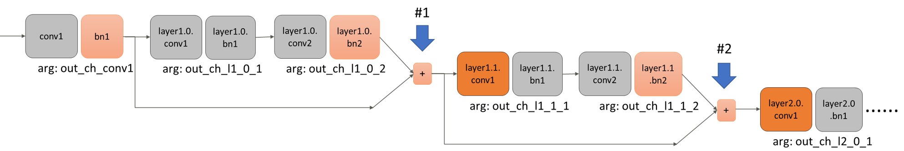

# Automatic Pruning Ver 1.1.0

Automatic Pruning はニューラルネットワークのプルーニングを実行するPythonモジュールです。  
このモジュールの特徴は、下記のとおりです。  
* 各レイヤのプルーニング率を自動的に決定することができる。  
* structured pruningを実行する
  * 畳み込み層はチャネル単位でプルーニング、全結合層はニューロン単位でプルーニングを行う。
* サンプルコードに使用する事前学習済みモデルとプルーニング済みモデルは下記サイトからダウンロードできます。    
  事前学習済みモデル     : https://zenodo.org/record/5725006#.YZ5cSNDP0uU  
  プルーニング済みモデル : https://zenodo.org/record/5725038#.YZ5cY9DP0uU  
  
|Dataset|Model|Pre-trained model accuracy(%)|Pruned model accuracy(%)|Pre-trained model size(MB)|Pruned model size(MB)|Model size compression ratio(%)| 
|:----:|:----:|:----:|:----:|:----:|:----:|:----:|
|MNIST|3-layer MLP|98.44|97.48|7.46|1.14|84.7|
|CIFAR10|AlexNet|90.59|89.62|145.50|1.87|98.7|
|CIFAR10|vgg11|85.70|84.71|515.23|0.80|99.8|
|CIFAR10|vgg11_bn|92.39|91.58|112.64|2.60|97.7|
|CIFAR10|vgg16_bn|93.78|93.82|60.04|6.26|89.6|
|CIFAR10|ResNet18|92.62|91.71|44.78|1.56|96.5|
|CIFAR10|ResNet32|92.63|92.70|1.92|0.69|64.0|
|CIFAR10|ResNet56|93.39|93.40|3.52|0.93|73.5|
|CIFAR10|ResNet110|93.68|93.70|7.12|1.31|81.7|

## Requirements
* Python  >= 3.6
* Pytorch >= 1.6
* Torchvision >= 0.6.0+cu101
* Numpy  >= 1.18.2
* tqdm   >= 4.62.0

## Quick start
### プルーニングの実行
1. サンプルコードのディレクトリに移動する。  
```
cd /examples/<sample>
```
2. 事前学習済みモデルを https://zenodo.org/record/5725006#.YZ5cSNDP0uU から、サンプルコードのディレクトリにダウンロードする。  
```
>>> ls /examples/<sample>/*.pt  
pretrained_xxx.pt  
```
3. `run.sh`を実行する。  
```
chmod +x run.sh && ./run.sh
```
### プルーニング済みモデルの推論の実行
1. サンプルコードのディレクトリに移動する。  
```
cd /examples/<sample>
```
2. プルーニング済みモデルを https://zenodo.org/record/5725038#.YZ5cY9DP0uU から、サンプルコードのディレクトリにダウンロードする。
```
>>> ls /examples/<sample>/*.pt
pruned_xxx.pt
```
3. `run_pruned.sh`を実行する。
```
chmod +x run_pruned.sh && ./run_pruned.sh
```

## サンプルコードの実行方法

サンプルコードの[`AlexNet`](https://github.com/FujitsuLaboratories/CAC/tree/main/cac/pruning/examples/AlexNet)を例に説明する。  

### 1. 事前準備

初めに、以下の手順を実施してください。
* 本GithubをClone、もしくはソースコード一式をダウンロードする。  
* 適当なターミナルを起動し、`examples\AlexNet`ディレクトリに移動する。  

### 2. プルーニング対象となる事前学習済みモデルの準備

プルーニング対象となる事前学習済みモデルを準備してください。  
事前学習済みモデルのパスを、`main.py`中の引数`args.model_path`に設定してください。  
サンプルコード向けの事前学習済みモデルは、https://zenodo.org/record/5725006#.YZ5cSNDP0uU からダウンロード可能です。

以下のコマンドを実行することで、CIFAR-10による事前学習済みモデルを作成することもできます。  
```bash
python3 make_model.py
```   

### 3. プルーニングの実行  
ターミナルで、以下のコマンドを実行してください。  
```bash
# On GPU
python3 main.py --use_gpu --use_DataParallel

# On CPU
python3 main.py

# データのパスを指定する場合は、--dataを使用すること。 
``` 
  
### 4. pruning結果の確認
ターミナルに下記のように出力されれば、実行完了。  

```bash
(omitted)
===== model: after pruning ==========
DataParallel(
  (module): AlexNet(
    (conv1): Conv2d(3, 64, kernel_size=(3, 3), stride=(1, 1), padding=(1, 1))
    (pool1): MaxPool2d(kernel_size=2, stride=2, padding=0, dilation=1, ceil_mode=False)
    (conv2): Conv2d(64, 256, kernel_size=(5, 5), stride=(1, 1), padding=(2, 2))
    (pool2): MaxPool2d(kernel_size=2, stride=2, padding=0, dilation=1, ceil_mode=False)
    (conv3): Conv2d(256, 384, kernel_size=(3, 3), stride=(1, 1), padding=(1, 1))
    (conv4): Conv2d(384, 256, kernel_size=(3, 3), stride=(1, 1), padding=(1, 1))
    (conv5): Conv2d(256, 256, kernel_size=(3, 3), stride=(1, 1), padding=(1, 1))
    (pool5): MaxPool2d(kernel_size=2, stride=2, padding=0, dilation=1, ceil_mode=False)
    (avgpool): AdaptiveAvgPool2d(output_size=(4, 4))
    (drop1): Dropout(p=0.5, inplace=False)
    (fc1): Linear(in_features=4096, out_features=4096, bias=True)
    (drop2): Dropout(p=0.5, inplace=False)
    (fc2): Linear(in_features=4096, out_features=4096, bias=True)
    (fc3): Linear(in_features=4096, out_features=10, bias=True)
  )
)
===== Results =====
Model size before pruning (Byte): 145504179
Model size after pruning  (Byte): 25541488
Compression rate                : 0.824
Acc. before pruning: 90.59
Acc. after pruning : 89.72
Arguments of pruned model:  {'out_ch_conv1': 41, 'out_ch_conv2': 105, 'out_ch_conv3': 158, 'out_ch_conv4': 131, 'out_ch_conv5': 131, 'out_ch_fc1': 1678, 'out_ch_fc2': 1342}
```
注) `model: after pruning`に表示されるモデルの各レイヤのチャネル数や`Results`の各数値は、実行環境等により異なることがある。

`examples`ディレクトリに格納している他のサンプルも、AlexNetと同様の手順で実行可能です。  

## ユーザーが用意するモデルのプルーニング方法
### 1. モデル定義の変更  
`auto_prune.py`は、モデルが`torch.nn.Moduleを継承したclass`として定義されていることを前提とします。  
`auto_prune.py`を適用するためには、ユーザーが定義したclass(例えば`/examples/AlexNet/alexnet.py`で定義している`class AlexNet`)に対して以下の変更を行う必要があります。  
* torch.nn.Conv2d(or Conv1d)レイヤの引数`out_channels`とtorch.Linearレイヤの引数`out_features`を`__init__`メソッドの引数にする。  
これにより、インスタンス化の際に各レイヤのout_channelsとout_featuresの値を指定できるようになる。
* 最終レイヤの出力数は固定とする。例えばCIFAR-10の場合、最終レイヤの出力数は10とする。  
* 上記の変更に合わせて、pruning対象外のレイヤの入出力を変更する。  

### 2. model_infoの設定
各サンプルコードを実行する`main.py`中で記載しているmodel_infoは、プルーニング対象となるモデルの構成情報となります。
`auto_prune.py`は、この情報を元にプルーニングを行います。  
例えば、`/examples/AlexNet/main.py`に記載しているmodel_infoは下記となります。
```python
from collections import OrderedDict
# Model information for pruning
model_info = OrderedDict(conv1={'arg': 'out_ch_conv1'}, 
                         conv2={'arg': 'out_ch_conv2'},
                         conv3={'arg': 'out_ch_conv3'},
                         conv4={'arg': 'out_ch_conv4'},
                         conv5={'arg': 'out_ch_conv5'},
                         fc1={'arg': 'out_ch_fc1'},
                         fc2={'arg': 'out_ch_fc2'},
                         fc3={'arg': None})  # 最終レイヤの出力はNoneとしておく
```

* 上記のように、ネットワークの各レイヤ名とその出力引数名との対応を、`OrderedDict`で定義する。  
OrderedDictは、Python標準ライブラリの`collections`に含まれるclassである。  
* OrderedDictに記載する各レイヤは、ネットワークの順伝播の順に記述する。  
これによって、各レイヤの接続順を表現する。
* 記述対象のレイヤは、`torch.nn.Conv1d`, `torch.nn.Conv2d`, `torch.nn.BatchNorm1d`, `torch.nn.BatchNorm2d`, `torch.nn.Linear`である。  
`DropoutレイヤやReLuレイヤ等の情報はmodel_infoに記述しないでください。`
* OrderedDictのkeyには、モデルクラスで定義した各レイヤ名(インスタンス変数名)が入る。  
ただし、`torch.nn.Sequential`等を使って複数のレイヤをまとめて定義する場合は、注意が必要である。  
その場合、個々のレイヤ名が自動で命名される。  
例えば、以下のように複数のレイヤをまとめて定義した場合、
  ```python
  import torch.nn as nn
  self.classifier = nn.Sequential(nn.Linear(out_ch_conv8 * 1 * 1, out_ch_fc1),  # 1
                                  nn.ReLU(True),  # model_infoへの記載対象外
                                  nn.Dropout(),  # model_infoへの記載対象外
                                  nn.Linear(out_ch_fc1, out_ch_fc2),  # 2
                                  nn.ReLU(True),  # model_infoへの記載対象外
                                  nn.Dropout(),  # model_infoへの記載対象外
                                  nn.Linear(out_ch_fc2, num_classes))  # 3(最終レイヤ)
  ```
  model_infoは、以下のように指定する。
  ```python
  model_info = OrderedDict()
  model_info['classifier.0'] = {'arg': 'out_ch_fc1'}  # 1
  model_info['classifier.3'] = {'arg': 'out_ch_fc2'}  # 2
  model_info['classifier.6'] = {'arg': None}  # 3(最終レイヤ)
  ```
* OrderedDictの各keyの値には、`{'arg': そのレイヤの出力引数名}`を指定する。  
ただし、最終レイヤの出力引数は`None`としておくこと。これは、最終レイヤの出力がpruningの対象外だからである。

#### 残差結合を含むネットワークの場合
対象レイヤの直前に残差結合が存在するときは、以下のようにその直前のレイヤ名を`'prev'`keyで指定すること。  
例として、サンプル`ResNet18`のネットワーク構成図の一部と、それに対するmodel_infoを示す。  



この場合、`'layer1.1.conv1'`レイヤと`'layer2.0.conv1'`レイヤの直前に残差結合(#1, #2)が存在する。
* 'layer1.1.conv1'レイヤの直前のレイヤ名は、'bn1'と'layer1.0.bn2'である。
* 'layer2.0.conv1'レイヤの直前のレイヤ名は、'bn1'と'layer1.0.bn2'と'layer1.1.bn2'である。  
これをmodel_infoに反映させると、以下のようになる。

```python
# Model information for pruning
model_info = OrderedDict()
(omitted)
model_info['layer1.1.conv1'] = {'arg': 'out_ch_l1_1_1', 'prev': ['bn1', 'layer1.0.bn2']}  # 1
(omitted)
model_info['layer2.0.conv1'] = {'arg': 'out_ch_l2_0_1', 'prev': ['bn1', 'layer1.0.bn2', 'layer1.1.bn2']}  # 2
(omitted)
```
詳細はサンプル`examples\ResNet18`を参照。  


### 3. auto-prune関数の実行

まず、`auto_prune.py`から`auto_prune`関数をimportする。  
import例は以下の通り。  
```python
from auto_prune import auto_prune
```

次に、ユーザーのモデルに合わせた引数を`auto_prune`関数に渡して実行する。  
実行例は以下の通り。
```python
weights, Afinal, n_args_channels = auto_prune(AlexNet, model_info, weights, Ab,
                                              train_loader, val_loader, criterion)
```
model_infoの指定方法は、`model_infoの設定`の項を参照してください。 

### 4. プルーニング後のモデルの使用方法

以下の例のように、pruning後のチャネル数を引数としてモデルをインスタンス化し、state_dictをロードしてください。
```python
from alexnet import AlexNet
model = AlexNet(**n_args_channels)  # n_args_channelsはauto_prune関数の返り値
model.load_state_dict(torch.load(pruned_model_path), strict=True)
```

## Tips

### 訓練済みモデルのkey名の書き換え方法

訓練済みモデルの重み等のkey名を変更する場合、モデルの重みをstate_dict()で一旦保存する。  
このとき、state_dictは単なるOrderedDict型であり、必要に応じてkeyの変更が可能である。  
モデルのkeyは`model.state_dict().keys()`で確認できる。  

### 特定のレイヤをpruning対象から除外する方法

model_infoに、`'prune': False`を追加することで、特定のレイヤをpruning対象から除外することができる。  
例えば、AlexNetのmodel_infoで以下のように指定すると、`conv1, conv3, conv5, fc1`はpruning対象から除外される。
```python
model_info = OrderedDict(conv1={'arg': 'out_ch_conv1', 'prune': False},
                         conv2={'arg': 'out_ch_conv2'},
                         conv3={'arg': 'out_ch_conv3', 'prune': False},
                         conv4={'arg': 'out_ch_conv4'},
                         conv5={'arg': 'out_ch_conv5', 'prune': False},
                         fc1={'arg': 'out_ch_fc1', 'prune': False},
                         fc2={'arg': 'out_ch_fc2'},
                         fc3={'arg': None})
```

### モデルの圧縮率が低いとき
既定の設定でモデルの圧縮率が低い場合は、以下の対応を検討すること。

* 再訓練時のepoch数を増やす。再訓練時のepoch数は`/examples/<sample>/main.py`に記載している引数`args.epochs`で設定可能。
* 再訓練時のlearning rate schedulerやoptimizerなどの設定を変える。
* `/examples/<sample>/main.py`に記載している引数`args.acc_control`の値を増やす。
  * プルーニングされたモデルの精度は、`args.acc_control`の値を増やすほど劣化します。

## Limitations  
* pruning対象とするレイヤは、`torch.nn.Conv1d`, `torch.nn.Conv2d`, `torch.nn.Linear`のみ。  
  * ただし、畳み込み層に続いて接続される`torch.nn.BatchNorm1d`と`torch.nn.BatchNorm2d`のnum_featuresについては、接続する畳み込み層がプルーニングされた場合は同時にプルーニングする。


## Cautions

* 本Readmeに記載しているコマンドは、実行環境に依存する。

## Copyright  

COPYRIGHT Fujitsu Limited 2022
